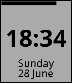

# Cleanface

A clean and minimal watchface for Pebble.

## Preview



## Features

- **Time** — 24-hour format (`HH:MM`), centered, Noto Sans Bold 49px
- **Date** — Full day name + day and month, anchored to the bottom, Noto Sans Regular 21px
- **Battery** — 10px horizontal bar across the top, width proportional to charge level

White background, black text. No clutter.

## Build & Install

```sh
pebble build
pebble install --phone <IP>
```

## Documentation

Full SDK docs, tutorials, and API reference: <https://developer.repebble.com>
